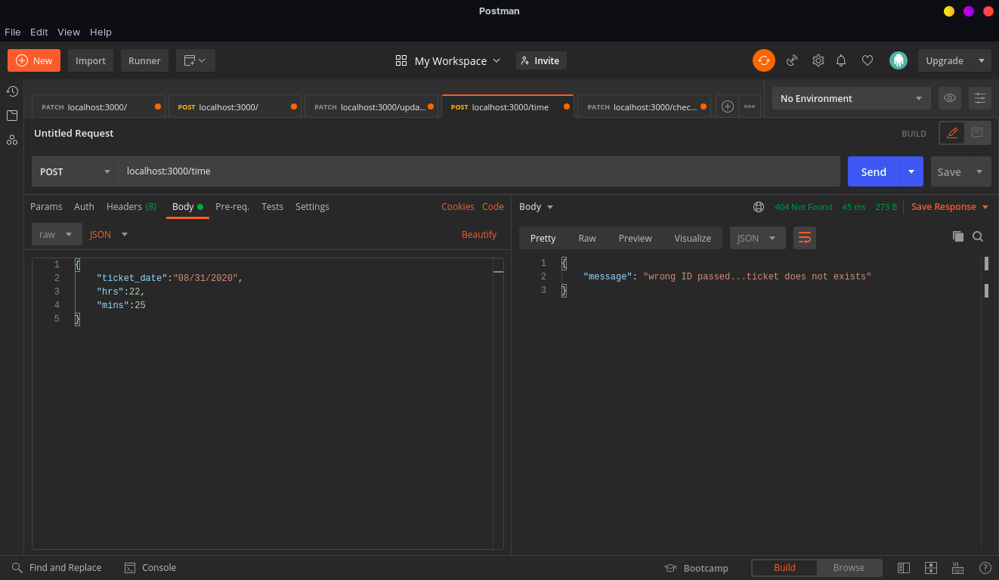

# Ticketing REST API
Backend REST Interface for ticketing system


### Business Cases
- [X] Create a ticket using name and phone number and timing.
- [X] Update a ticket using timing.
- [X] Delete a ticket using name timing.
- [X] Not allowing more than 20 people to book ticket for a timing.
- [X] Display all ticket using username and timing.
- [X] Expire a ticket after 8 hours.
- [X] Cron-job to mark and delete ticket if expired after 8 hours 


## Setup for the project

**Step 1:- Install nodejs**
* Download and follow the steps in the given [link](https://nodejs.org/en/download/) to install nodejs.

**Step 2:- Install mongodb**
* Download and follow the steps in the given [link](https://docs.mongodb.com/manual/administration/install-community/) to install mongodb.

**Step 3:- Cloning project**
* Fork the repository on github.
* Clone the repository by ```git clone https://github.com/rogers9798/Ticketing-System-REST-API``` 

**Step 4:- Installling modules**
* To install the nodejs modules which are required to run the project by running command ```npm install``` to install project dependencies

**Step 5:- Run the project**
* To run the project, you need to run the command ```npm start```

## Screenshots of POSTMAN API TEST :

### Delete details using Ticket_id


### Delete expired tickets using cron-job


### GET Details using ticket_id


### Max record response-1


### Max record response-2


### Max record response-3


### Enter ticket details


### GET ticket details using timings-1


### GET ticket details using timings-2


### UPDATE ticket timing 


